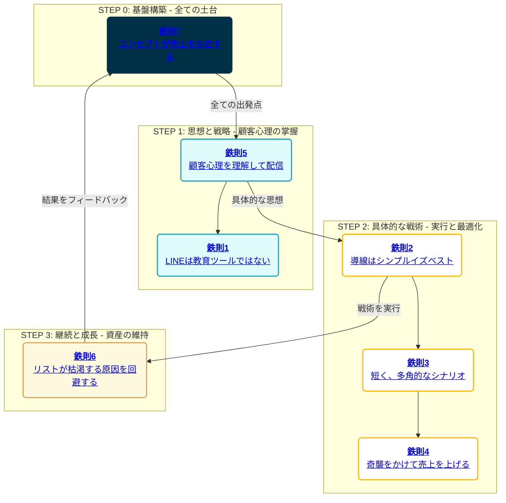

# シン・LINEマーケティング戦略バイブル【最終完全版】

この資料は、単なる情報の羅列ではありません。一流マーケターたちの普遍的な知見と、最新のAI活用術を融合させた、あなたのビジネスを成功に導くための**生きた戦略データベース**です。各項目はクリックすることで、必要な情報に瞬時にアクセスできます。

---

## Part 1: 戦略マップ（全体像）

*各項目をクリックすると、Part 2の詳細解説にジャンプします。*

---

## Part 2: 各鉄則の「100万円」コンサルティング解説

*（このセクションは前回の内容と同じです。各鉄則の詳細な解説が記載されています。）*

### 鉄則7: コンセプトが売上を左右する
（前回の詳細解説）

### 鉄則5: 顧客心理を理解して配信する
（前回の詳細解説）

### 鉄則1: LINEは教育ツールではない
（前回の詳細解説）

### 鉄則2: 導線はシンプルイズベスト
（前回の詳細解説）

### 鉄則3: 短く、多角的なシナリオ
（前回の詳細解説）

### 鉄則4: 売上を上げたければ、奇襲をかける
（前回の詳細解説）

### 鉄則6: リストが枯渇する原因を回避する
（前回の詳細解説）

---

## Part 3: 主要参考文献ノウハウ集 with AI活用術

ここでは、あなたの`Clippings`フォルダにある主要な教材の核心的ノウハウを、AI（私、Gemini）と共に実践するための具体的なフレームワークとして再構築しました。

**目次**
*   [【XマネタイズPRO】から学ぶ「ポジション取り」と「X特化ライティング」](#x-pro)
*   [【LINEコピーライティングマスター講座】から学ぶ「売れる文章の方程式」](#line-copy)
*   [【シンセカイ】から学ぶ「ストーリーテリング」と「世界観構築」](#shinsekai)
*   [【ハウル流ZOOMセールス】から学ぶ「高単価商品の仕組み化」](#howl)
*   [【せいや式オンラインセミナー】から学ぶ「資料不要の対話型セミナー術」](#seiya)

---

### 【XマネタイズPRO】から学ぶ「ポジション取り」と「X特化ライティング」

#### 1. この教材から得られる「核心的知見」
X（旧Twitter）で成功する本質は、小手先のテクニックではなく、**「誰が（ポジション）」「何を語るか（ライティング）」**に集約される。多くの人が同じような発信をして埋もれる中、独自のポジションを確立し、Xに最適化された文章術を身につけることこそが、最も楽に、かつ長期的に成果を出すための王道である。

#### 2. 実践的フレームワーク

**A. ポジション取り（13種類）**
*   **実力者系:** ①圧倒的実力者, ②村一番
*   **属性系:** ③女性, ④主婦, ⑤おじさん, ⑥会社員・副業
*   **専門家系:** ⑦開拓者, ⑧分析家・翻訳家, ⑨批評家
*   **関係性系:** ⑩一番弟子
*   **テーマ系:** ⑪HARM寄せ
*   **物語系:** ⑫主人公, ⑬教祖

**B. X特化ライティング（HPS理論）**
*   **Hook（フック）:** 最初の1〜2行で読者の足を止める。「衝撃的なコピー」「限定性」「読者の限定」「いきなりストーリー」など。
*   **Pass（パス）:** 読者が続きを読むための橋渡し。「結論・目次」「あとで詳しく解説」「宣伝・匂わせ」など。
*   **Stay（ステイ）:** ポストの滞在時間を延ばし、アルゴリズム評価を高める。「ググって出てこないリアル」「弱み・ストーリー」「真逆の価値観の否定」など。

#### 3. 【AI活用術】Geminiと実践する「ポジションニング戦略」

> **プロンプト例：**
> 「私は、LINEマーケティングのコンサルタントとして活動したいです。私の経歴は〇〇で、実績は△△です。沖ケイタさんの『XマネタイズPRO』で解説されている13のポジションに基づき、私が取るべき最適なポジションを3つ提案してください。また、それぞれのポジションで発信すべきコンテンツの切り口を5つずつ挙げてください。」

**AIができること:**
*   あなたの経歴と実績を客観的に分析し、最も響きやすいポジション（例：「分析家」「村一番」など）を提案します。
*   選択したポジションに基づき、具体的なポストのネタ（例：「多くの人が知らないLINE公式アカウントの罠5選」「私が月100万円を達成するまでにやったこと全リスト」など）を大量に生成します。
*   HPS理論に基づき、あなたが書いたポストの添削や、より魅力的なフックの提案を行います。

#### 4. アクションプラン
1.  上記のプロンプトを参考に、私にあなたの状況を伝え、最適なポジションの提案を受ける。
2.  提案されたポジションの中から1つを選び、そのポジションに沿ったプロフィールとヘッダーを作成する。
3.  AIが生成したコンテンツの切り口を参考に、最初の1週間分のポストを作成し、発信を開始する。

---

### 【LINEコピーライティングマスター講座】から学ぶ「売れる文章の方程式」

#### 1. この教材から得られる「核心的知見」
売れる文章は、センスや才能ではなく、**明確な「ロジック」と「パターン」**に基づいている。特にLINEでは、読者の「5つの壁（5NOT）」を突破し、URLをタップしてもらうための心理技術が不可欠。徹底的なリサーチと、実証済みのテンプレートを活用することで、誰でも反応率の高いコピーを書くことができる。

#### 2. 実践的フレームワーク

**A. LINE特有の「5NOT」を突破する**
1.  **Not Open (開かない):** パワーワードや黄金のヘッドコピーで、通知一覧で興味を引く。
2.  **Not Read (読まない):** 冒頭でベネフィットを提示し、読みやすい構成を心がける。
3.  **Not Believe (信じない):** 具体的なデータ、顧客の声、自身の失敗談などで信頼性を担保する。
4.  **Not Act (行動しない):** 緊急性、限定性、簡単な行動喚起で、行動へのハードルを下げる。
5.  **Not Remember (覚えていない):** 重要なことは、表現を変えて何度も伝える。

**B. URLクリック率を上げる4つの方法**
1.  **ベネフィットの提示:** リンク先に何があるかではなく、それをクリックすると「どんな良いことがあるか」を伝える。
2.  **緊急性・限定性:** 「本日23:59まで」「先着10名様」など。
3.  **問いかけ:** 「〇〇に興味がある方は、こちらをご確認ください」と問いかける。
4.  **追伸（P.S.）での案内:** 本文の最後で、追伸としてさりげなくリンクを案内する。

#### 3. 【AI活用術】Geminiと実践する「LINEコピー制作」

> **プロンプト例：**
> 「私はLINEで、30代の女性向けに『時間管理術』のセミナーを案内したいです。たくさんの『LINEコピーライティングマスター講座』の教えに基づき、以下の条件でLINEの配信メッセージを作成してください。
> *   **ターゲット:** 仕事と育児に追われ、自分の時間がないと感じている30代のワーキングマザー
> *   **目的:** 無料オンラインセミナーへの参加
> *   **盛り込む要素:** 5NOTの突破、共感、ベネフィットの提示、緊急性」

**AIができること:**
*   ターゲットの悩みに深く共感するペルソナを設定し、その心に響く言葉を選んでメッセージを作成します。
*   あなたが提供したい情報（セミナー内容など）を、魅力的なベネフィットに変換します。
*   100種類以上の穴埋めテンプレートを参考に、様々なパターンのコピーを瞬時に生成し、ABテストの実施を支援します。

#### 4. アクションプラン
1.  あなたが次に案内したい商品やセミナーについて、上記のプロンプトを参考に私にコピー作成を依頼する。
2.  生成された複数のコピー案の中から最も響くものを選び、配信する。
3.  クリック率などの反応を分析し、結果を私にフィードバックして、さらに改善されたコピー案を受け取る。

---

### 【シンセカイ】から学ぶ「ストーリーテリング」と「世界観構築」

#### 1. この教材から得られる「核心的知見」
真のセールスとは、商品を売ることではなく、**「物語（ストーリー）」を共有し、顧客を「新しい世界（シンセカイ）」へ導く**ことである。スキルやノウハウだけの発信は、いずれ飽きられ、より新しい情報に乗り換えられる。しかし、あなたの理念や生き様が込められたストーリーは、誰にも真似できない独自の価値となり、顧客を「ファン」へと昇華させる。

#### 2. 実践的フレームワーク

**A. 人を惹きつけるストーリーの構成要素**
1.  **The Ordinary World (日常):** 主人公（あなた、または顧客）が抱える、退屈または問題のある日常。
2.  **Call to Adventure (冒険への誘い):** 日常を抜け出すきっかけとなる出来事や出会い。
3.  **Refusal of the Call (冒険の拒絶):** 新しい世界へ進むことへの恐怖やためらい。
4.  **Meeting the Mentor (師との出会い):** 主人公を導く師や、重要な気づき。
5.  **Crossing the Threshold (境界線を超える):** 覚悟を決め、新しい世界へ一歩踏み出す。
6.  **Tests, Allies, and Enemies (試練、仲間、敵):** 目的を達成する過程で待ち受ける困難や、支えてくれる仲間。
7.  **The Reward (報酬):** 試練を乗り越えた末に手にする、物理的・精神的な報酬。
8.  **The Road Back (帰路):** 新しい力を手に入れ、元の世界へ帰還する。
9.  **Resurrection (復活):** 最後の試練を乗り越え、完全に新しい存在として生まれ変わる。
10. **Return with the Elixir (秘薬の持ち帰り):** 新しい世界で得た知見や力を、周りの人々を救うために使う。

#### 3. 【AI活用術】Geminiと実践する「理念のストーリー化」

> **プロンプト例：**
> 「私は、かつて会社員として消耗していましたが、Webデザインを学んで独立し、今では自由な働き方を手に入れました。この経験を、新田祐士さん・迫佑樹さんの『シンセカイ』で語られるストーリーテリングのフレームワークに基づき、LINEで配信するための感動的な物語に書き換えてください。特に、『冒険の拒絶』と『師との出会い』の部分を強調して、読者の共感を呼びたいです。」

**AIができること:**
*   あなたの断片的な経験談を、上記のストーリー構成要素に沿って再配置し、一貫性のある感動的な物語を構築します。
*   あなたの理念や伝えたいメッセージを、読者の心に響く比喩や象徴的な言葉に変換します。
*   あなたの物語の「主人公」に感情移入できるような、情景描写や心理描写を補強します。

#### 4. アクションプラン
1.  あなたのビジネスの原点となった経験や、最も伝えたい想いを私に語る。
2.  私が生成したストーリー案を元に、あなた自身の言葉で修正・加筆し、オリジナルの物語を完成させる。
3.  完成したストーリーを、LINEのステップ配信やプロフィールの記事として設定し、あなたの世界の入り口とする。

---

### 【ハウル流ZOOMセールス】から学ぶ「高単価商品の仕組み化」

#### 1. この教材から得られる「核心的知見」
高単価セールスは、気合や才能で行うものではなく、**徹底的に計算された「仕組み（テンプレート）」**で実行するものである。セミナーの構成、トークスクリプト、決済フローまでを標準化し、誰がやっても一定の成果が出る状態を作り上げることで、売上は安定し、組織化への道が開ける。

#### 2. 実践的フレームワーク

**A. 売れる高単価コンセプトの3要素**
1.  **緊急性:** なぜ「今」やる必要があるのか？
2.  **独自性:** なぜ「他」ではなく「あなた」から買う必要があるのか？
3.  **再現性:** なぜ「自分にもできる」と思えるのか？

**B. ZOOMセールスの基本構成**
1.  **ラポール形成:** 雑談や自己紹介で、信頼関係の土台を築く。
2.  **現状のヒアリング:** 相手の悩みや理想の未来を徹底的に聞き出す。
3.  **問題の再定義:** 相手が気づいていない「本当の問題」を提示する。
4.  **解決策の提示:** あなたの商品が、その問題を解決できる唯一の手段であることを示す。
5.  **未来の提示:** 商品を手に入れた後の、輝かしい未来を具体的にイメージさせる。
6.  **クロージング:** 価格を提示し、決断を促す。

#### 3. 【AI活用術】Geminiと実践する「セールスシナリオ作成」

> **プロンプト例：**
> 「私は、価格30万円のWebライティング講座をZOOMで販売したいです。ハウルさんの『ZOOMセールステンプレート』に基づき、セールス全体のトークスクリプトを作成してください。特に、参加者の不安を解消し、購入を決断させるための『不安解消トーク』と『決断トーク』を重点的に、具体的な言い回しを複数パターン提案してください。」

**AIができること:**
*   あなたの商品の特徴とターゲット顧客に合わせて、セールスの全行程のトークスクリプトを生成します。
*   顧客が抱きがちな「お金がない」「時間がない」「自分にはできない」といった典型的な不安に対する、切り返しトークを網羅的に作成します。
*   セミナー後の個別相談で使うための、詳細なヒアリングシートや質問リストを作成します。

#### 4. アクションプラン
1.  上記のプロンプトを参考に、あなたの商品のセールススクリプト作成を私に依頼する。
2.  生成されたスクリプトを元に、何度も声に出して読み、自分の言葉として完全にマスターする（シャドウイング）。
3.  実際にセールスを行い、顧客の反応が良かった部分、悪かった部分を私にフィードバックし、スクリプトを継続的に改善する。

---

### 【せいや式オンラインセミナー】から学ぶ「資料不要の対話型セミナー術」

#### 1. この教材から得られる「核心的知見」
オンラインセミナーの成否は、**作り込まれた資料ではなく、参加者との「コネクト（繋がり）」の深さ**で決まる。講師が一方的に話すのではなく、参加者を巻き込み、対話し、共にセミナーを作り上げていく「アクティブセミナー」形式こそが、参加者の熱量を最大化させ、高い成約率を実現する。

#### 2. 実践的フレームワーク

**A. コネクトを生み出す3つの仕掛け**
1.  **エンロールクエスチョン:** セミナー冒頭で、全員が手を挙げられるような簡単な質問を投げかけ、一体感を生み出す。
2.  **ブレイクアウトルーム:** 参加者を少人数のグループに分け、特定のテーマについて話し合ってもらう。これにより、受け身の姿勢を崩し、当事者意識を持たせる。
3.  **指名と賞賛:** 「〇〇さん、素晴らしい意見ですね！」のように、積極的に参加者の名前を呼び、発言を褒めることで、双方向のコミュニケーションを活性化させる。

**B. 資料不要のシナリオ構成**
*   **導入:** ルール説明、セミナーテーマの提示、期待値の向上。
*   **メインストーリー:** 「問題提起 → 原因 → 解決策」のサイクルを、参加者との対話を交えながら繰り返す。
*   **バックエンドセールス:** 未来を提示し、限定性のあるオファーで行動を促す。

#### 3. 【AI活用術】Geminiと実践する「アクティブセミナー設計」

> **プロンプト例：**
> 「私は、Instagram集客に関する2時間のオンラインセミナーを開催します。せいやさんの『せいや式オンラインセミナー』の考え方に基づき、資料を使わずに参加者の熱量を最大化するための、インタラクティブなセミナーシナリオを時間配分付きで作成してください。特に、参加者を飽きさせないための『エンロールクエスチョン』や『ワーク（問いかけ）』の具体的な内容を10個以上提案してください。」

**AIができること:**
*   セミナーのテーマと時間に合わせて、参加者を巻き込むための詳細な進行台本と時間配分を作成します。
*   参加者の当事者意識を高めるための、効果的な問いかけや、ブレイクアウトルームでのディスカッションテーマを多数生成します。
*   セミナーの最後に使用する「ハートフルストーリー」について、あなたの経験談を元に、より感動的で共感を呼ぶ構成案を提案します。

#### 4. アクションプラン
1.  あなたが開催したいセミナーのテーマと時間を私に伝え、インタラクティブなシナリオの作成を依頼する。
2.  生成されたシナリオを元に、セミナーのリハーサルを行う。
3.  セミナー本番では、参加者の反応を最優先し、シナリオに固執しすぎず、柔軟な対話（コネクト）を心がける。