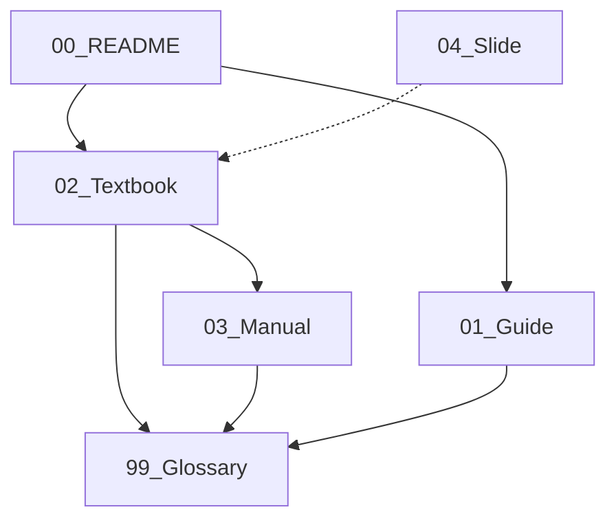

# 🗺️ M9 並列開発ワークフロー ドキュメント (README)

ようこそ、AI共創開発の世界へ。
このフォルダには、AI（Claude）と協力してWebアプリを開発するための全ての知恵が詰まっています。

## 🚀 読み進め方ガイド

あなたの目的に合わせて、以下の順番で読むことを推奨します。

### 👶 初心者・非エンジニアの方
まずは「概念」を理解し、実際に「体験」してみましょう。

1. **[教科書] AIとつくる未来の働き方** (`02_Textbook_Draft.md`)
   - プログラミング不要。「指揮者」としてのマインドセットを学びます。
2. **[研修マニュアル] 1時間で体験するAI開発** (`03_Training_Manual.md`)
   - 実際に手を動かして、1時間でWebサイトを作ってみましょう。
3. **[超訳用語集] 初心者向け用語集** (`99_Glossary.md`)
   - 難しい言葉が出てきたら、ここをチェック。「Git = セーブポイント」など。

### 🧑‍💻 実務者・プロを目指す方
チーム開発に耐えうる「プロの作法」を学びます。

1. **[実務ガイド] 並列開発ワークフロー** (`01_Workflow_Guide.md`)
   - Web → GitHub → Chat → Local の具体的な連携フロー。
   - トラブルシューティング、Gitコマンド集。

### 🎤 研修講師・プレゼンターの方
他者に伝えるための資料です。

1. **[スライド構成] 初心者向けスライド案** (`04_Slide_Structure.md`)
   - "Friendly Future" をテーマにしたプレゼン構成とナレーション。

---

## 🔗 ドキュメント相関図

---
*Version: 1.0.0 (Loop 1 Refined)*
