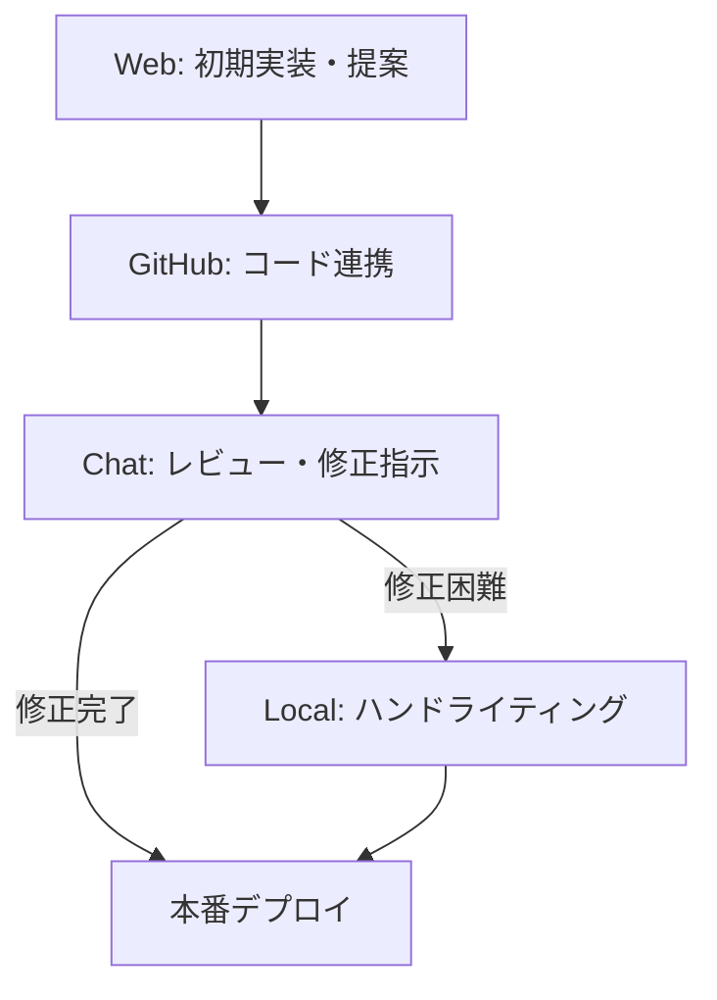

# M9: 並列開発ワークフロー 実務ガイド (Workflow Guide)

## 📌 概要
このドキュメントでは、AI（Claude 4.5 / Claude Code Web）を活用した「並列開発ワークフロー」の具体的な手順とルールを定義します。開発チーム向けの実務マニュアルです。

## 🔄 コア・ワークフロー図


## 1. Webフェーズ（Starter）
- **ツール**: Claude Code Web (Main), Claude 4.5
- **役割**: 0→1のコード生成、大規模リファクタリング、複数ファイルの一括生成
- **具体的な指示パターン**:
    - **新規機能**: 「XX機能を実装して。必要なコンポーネントとAPIルートをすべて作成して」
    - **リファクタリング**: 「このフォルダ内のtsファイルをすべてチェックして、重複コードをutilsにまとめて」
- **クオリティ基準**:
    - Buildエラーが多少あってもOK（後で直す）
    - ファイル構成と主要ロジックが合っていれば合格
    - **重要**: `npm run dev` で起動できなくても、コードが存在すれば次のフェーズへ進む

## 2. GitHubフェーズ（Connector）
- **ツール**: GitHub Actions, Vercel
- **役割**: Webで生成されたコードの受け渡し、自動テスト、プレビュー
- **コマンドライン操作 (Terminal)**:
    ```bash
    # 最新コードの取得（チーム開発推奨：コミットログを綺麗に保つ）
    git pull --rebase origin main
    
    # 作業中のファイルがある状態でpullする場合
    git stash       # 一時退避
    git pull --rebase origin main
    git stash pop   # 復元（ここでコンフリクトしたら解消してね）
    
    # 新しい作業ブランチの作成（必須）
    git checkout -b feature/new-function
    ```
- **コミットルール**:
    - **Atomic Commit**: 変更は「1つの機能」単位でコミットする。（修正と機能追加を混ぜない）
    - `feat:` 新機能
    - `fix:` バグ修正
    - `docs:` ドキュメントのみ
    - `style:` コードの意味に影響しない変更（空白、フォーマットなど）
    - `refactor:` バグ修正も機能追加も行わないコード変更

## 3. Chatフェーズ（Reviewer & Refiner）
- **ツール**: Antigravity (Cursor / VS Code)
- **役割**: 生成コードのクロスチェック、細部の修正、エラーハンドリング
- **手順**:
    1. Webのコードをpullする
    2. エージェントに全体を読ませて整合性をチェック
    3. `multi_replace_file` 等で微調整

## 4. Localフェーズ（Last Resort）
- **ツール**: VS Code, Terminal
- **役割**: AIには難しい微妙なニュアンスの修正、複雑なバグフィックス、最終調整
- **ハンドライティングが必要なケース**:
    - デザインの微調整（px単位の修正など）
    - APIキーや環境変数の設定（セキュリティ関連）
    - 複雑な条件分岐のデバッグ
- **心構え**:
    - 「AIに指示するより自分で書いた方が早い」と判断したら即座に切り替える（3分悩んだら書く）
    - 修正後は必ず `git add -p` 等で変更箇所を細かく確認してからコミット

## ⚠️ トラブルシューティング & FAQ

### ケース1: Webが生成したコードでビルドエラーが大量に出る
**対応**:
1. エラーログを全てコピーする
2. Chat（Codex/Antigravity）に貼り付け、「このエラーを修正するプランを立てて」と指示
3. 修正案に基づき、ファイルを上書き修正

### ケース2: Gitコンフリクトが発生した
**対応**:
1. VS Codeの「Merge Editor」を使用する（怖がらない！）
2. どちらを採用するか迷ったら「Current Change（手元）」を残し、後でAIに整合性をチェックさせる
3. 解決後、必ず動作確認を行ってからコミット

### ケース3: AIが「できません」と言い出した
**対応**:
1. 指示が抽象的すぎる可能性あり
2. 「まず計画だけ立てて」「ファイルリストだけ作って」とステップを分解する
3. それでもダメなら、別のモデル（GPT-4o → Claude 3.5 Sonnetなど）に切り替える

---
*Author: Antigravity*
