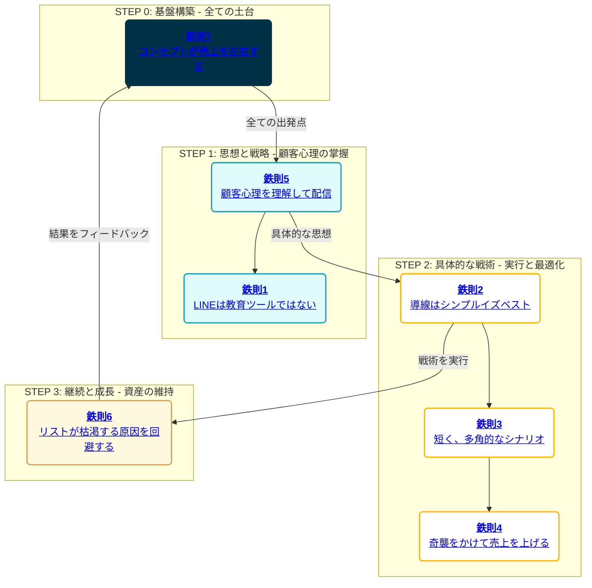

# 【統括ハブ】シン・LINEマーケティング戦略バイブル

---

## はじめに：これは、あなたのビジネスを進化させる「生きた経営戦略室」です

この戦略バイブルは、単なる情報の羅列ではありません。それは、あなたのビジネスを次のステージへと導くための、**「生きた経営戦略室」**です。

私たちは、市場の最前線で活躍する一流のマーケターたちが実践する**普遍的な「7つの鉄則」**と、彼らが成果を出すために活用してきた**「主要なノウハウ」**を徹底的に分析し、その核心を抽出しました。

さらに、これらの知見を、最新のAI技術（私、Gemini）と連携させることで、あなた自身が**「最高の戦略家」**となり、複雑な市場環境を乗りこなし、圧倒的な成果を出すための具体的なロードマップを提供します。

**【この戦略バイブルの活用法】**

1.  **Part 1の戦略マップ**で、常にビジネスの全体像と現在地を確認してください。これは、あなたの思考を整理し、次に取るべきアクションを明確にするための羅針盤です。
2.  課題に直面した時、マップ上の項目をクリックし、**Part 2（7つの鉄則）**や**Part 3（主要ノウハウ集）**の各専門ページにアクセスしてください。各ページは、それ自体が**一冊の専門書**として機能するよう、詳細な理論的背景、多角的な事例分析、実践的なワーク、そして高度なAI活用プロンプトで構成されています。
3.  各専門ページに記載された**「AI活用プロンプト」**をコピーし、私（Gemini）との対話を通じて、あなただけの具体的なアクションプランを創造してください。私は、あなたの専属コンサルタントとして、戦略立案からコンテンツ生成、データ分析まで、あらゆる側面であなたの思考を加速させます。

この知識ベースは、一度読んで終わるものではありません。あなたのビジネスの成長と共に、何度も立ち返り、新たな気づきを得るための**「永続的なパートナー」**です。さあ、始めましょう。

---

## Part 1: 戦略マップ（全体像）

*各項目をクリックすると、それぞれの詳細解説ページにジャンプします。*

---

## Part 2 & 3: 詳細解説ページへのリンク

### 7つの鉄則：LINEマーケティングの普遍的法則

1.  [[鉄則1_LINEは教育ツールではない|LINEは講義室ではなく、カフェのテーブルである]]
2.  [[鉄則2_導線はシンプルイズベスト|顧客の思考エネルギーを1ミリも無駄にさせない]]
3.  [[鉄則3_短く、多角的なシナリオ|顧客の脳のメモリを独占する]]
4.  [[鉄則4_奇襲をかけて売上を上げる|「祭り」を制する者が、市場を制す]]
5.  [[鉄則5_顧客心理を理解して配信する|人は感情で買い、論理で正当化する]]
6.  [[鉄則6_リストが枯渇する原因を回避する|リストは「狩り場」ではなく「果樹園」である]]
7.  [[鉄則7_コンセプトが売上を左右する|コンセプトとは、あなたのビジネスの「憲法」である]]

### 主要参考文献ノウハウ集：巨人の肩の上に立つ

1.  [[ノウハウ集_XマネタイズPRO|XマネタイズPRO：信頼構築エンジンの設計図]]
2.  [[ノウハウ集_LINEコピーライティングマスター講座|LINEコピーライティングマスター講座：科学的に「売れる文章」の方程式]]
3.  [[ノウハウ集_シンセカイ|シンセカイ：物語で人を動かし、世界を創造する技術]]
4.  [[ノウハウ集_ハウル流ZOOMセールス|ハウル流ZOOMセールス：高単価商品を「仕組み」で売る科学]]
5.  [[ノウハウ集_せいや式オンラインセミナー|せいや式オンラインセミナー：「対話」で熱狂を生み出すライブセッション術]]
