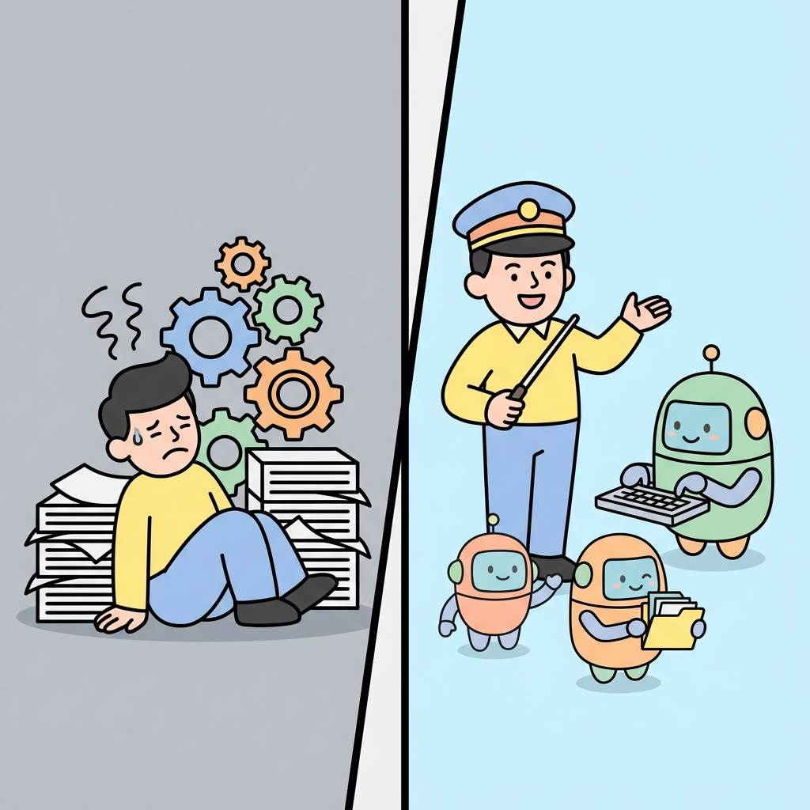
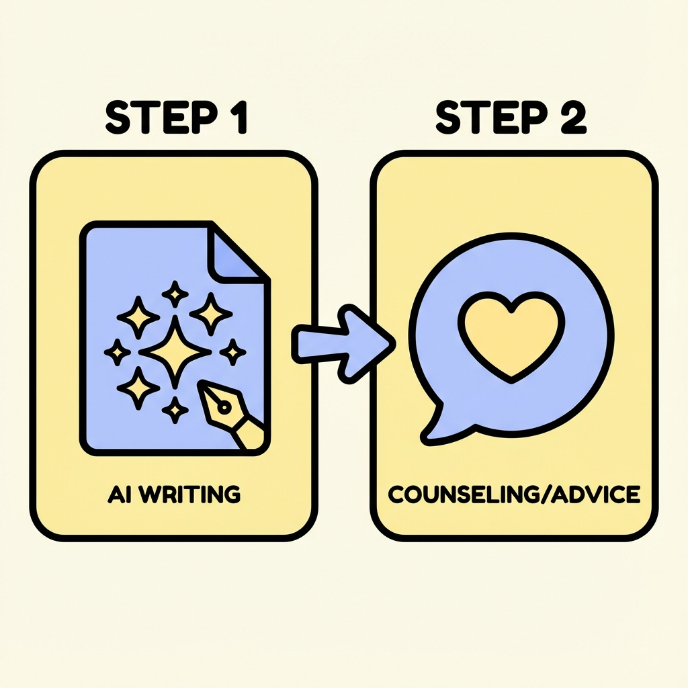
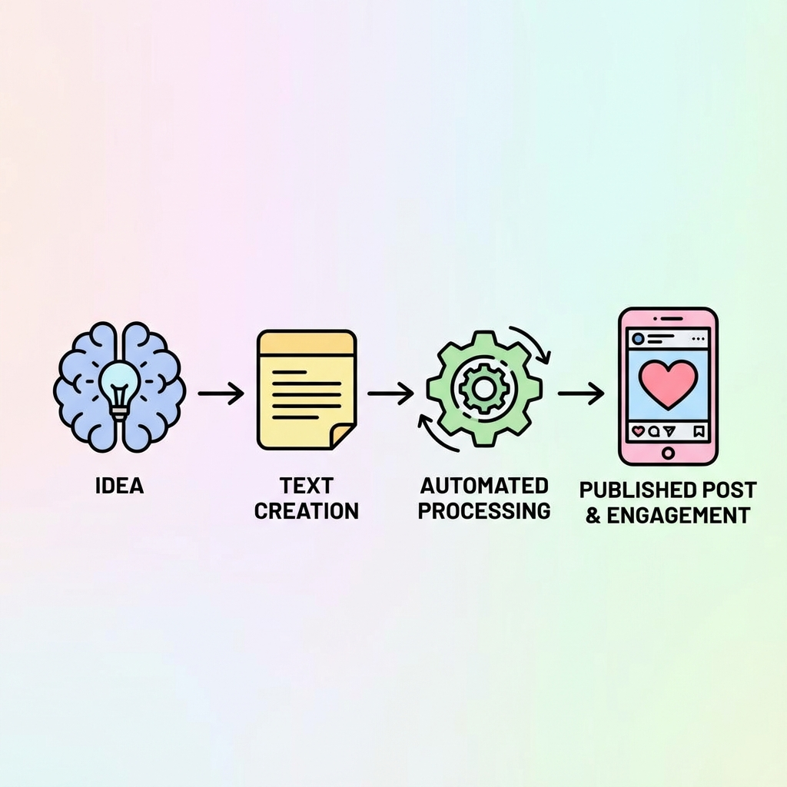

# 【会社に頼らず月5万稼ぐ】AI副業 "最短ルート" ロードマップ ~思考のリデザイン~

*(↑ この場所に `note_thumbnail.png` を挿入)*

「プログラミングを始めたけど挫折した」
「動画編集スクールに通ったけど案件が取れない」
「AIプロンプト集を買ったけど使い道がない」

もしあなたがそう感じているなら、それはあなたの能力不足ではありません。
**「自分に合わないルート」を選んでいるだけ** です。

この記事では、無駄な努力をすべて捨てて、あなたの強みを活かせる **「最短ルート」** だけを提示します。

---

## 1. 多くの人が陥る「労働集約の罠」

私たちは皆、「スキルを身につければ稼げる」と教わってきました。
しかし、AI時代においてその常識は危険です。

*(↑ この場所に `note_diagram_labor.png` を挿入)*

*   **労働集約型**: 自分の時間を切り売りして稼ぐ（限界がある）
*   **ディレクション型**: AIという「優秀な部下」に指示を出して稼ぐ（レバレッジが効く）

今目指すべきは、後者の **「AI時代のプレイングマネージャー」** です。

## 2. 実践編：0→1を作る具体的なステップ

では、具体的に何をすればいいのか？
初心者がまず目指すべきは **「AIを使って1円でも稼ぐ」** という成功体験です。

*(↑ この場所に `note_diagram_steps.png` を挿入)*

### Step 1: クラウドワークスで "AIライター" になる
「え、今さらライター？」と思うかもしれません。しかし、これこそがAIの威力を最も体感できる場所です。
*   **狙い目**: SEO記事作成、YouTube台本作成
*   **ハック**: 全文を自分で書くのではなく、構成案と執筆をAIに任せ、自分は「編集長」としてチェックするだけ。これで時給単価は劇的に上がります。

### Step 2: ココナラで "お悩み相談" をスキル化する
実は、カウンセリングや占いもAIの得意分野です。
AIは感情に左右されず、論理的かつ共感的なアドバイスを一瞬で生成できます。これに、ほんの少し「あなたの経験」というスパイスを加えるだけで、感謝される商品になります。

## 3. 発展編：1→10にする "自動化" の魔法

労働収入で感覚を掴んだら、次はそれを「仕組み」に変えます。
私が実践しているのが、**「Threads × GAS」** による自動発信システムです。

*(↑ この場所に `note_diagram_auto.png` を挿入)*

*   Notionに「ネタ」を放り込む。
*   寝ている間に、プログラムが勝手に投稿文を作り、発信してくれる。
*   朝起きると、フォロワーが増え、リストが集まっている。

**「自分が動かなくても価値が生まれる状態」** を作ること。これこそが、会社に頼らず月5万を安定させる鍵です。

---

## 4. あなただけの「勝ちパターン」を見つけよう

ここまで読んで、「自分にもできそう」と思った方もいれば、「やっぱり難しそう」と思った方もいるでしょう。
実は、AI副業には「相性」があります。

*   **話すのが得意** → コーチング型
*   **書くのが得意** → ブログ/Note型
*   **分析が得意** → エンジニア型

あなたが最短で成果を出すために、どのルートを通るべきか？
それを診断し、あなただけの「攻めの設計図」をプレゼントする **「無料ロードマップ作成会」** を開催しています。

*(↑ この場所に `note_banner_cta.png` を挿入)*

**👉 [無料個別相談会の詳細はこちら](LINK_TO_LP)**

通常3万円のコンサルティングですが、この記事を読んでくれた方限定で無料枠をご用意しました。
自分だけの地図を手に入れて、AI時代の新しい働き方を始めましょう。
