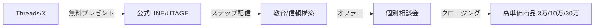

# 別紙：無料プレゼント企画 & 個別相談ファネル (High Ticket Sales)

**【目的】**
Threads/Xから「無料プレゼント」でLINEリストを集め、教育（Nurturing）を経て「個別相談（ロードマップ作成会）」へ誘導し、高単価商品（3万/10万/30万）を販売する。

## 1. キャンペーン全体像 (The Funnel)

## 2. 商品設計 (The Offer)
- [x] **無料プレゼント (Lead Magnet)**
    - [x] コンセプト決定（「稼ぎ方」or「時短」or「自己分析」）
    - [x] コンテンツ作成 (PDF/動画/Notion)
- [ ] **高単価商品 (Back End)**
    - **Bronze (3万円)**: スポットコンサル / プロフィール添削 等
    - **Silver (10万円)**: 1ヶ月伴走 / 短期集中講座
    - **Gold (30万円)**: 3ヶ月コーチング / 完全プロデュース

## 3. 導線構築 (System: UTAGE)
- [x] **UTAGE × LINE連携 (最重要)**
    - [x] UTAGE「メール・LINE配信」> アカウント追加
    - [x] LINE Developersでチャネル作成 (Messaging API)
    - [x] Channel ID / Secret をUTAGEにコピペ
    - [x] Webhook URL をLINE側に設定 (「応答」はBotモード、「あいさつ」はOFF)
- [ ] **ファネル構築 (自動化)**
    - [ ] 「ファネル追加」> テンプレート選択 (リスト取り・動画販売など)
    - [x] **LP (オプトイン)**: 無料プレゼント訴求ページの作成 (ヘッダー・本文実装完了)
    - [ ] **サンクスページ**: 「LINE登録ありがとうございます」+ 特典配布
    - [ ] **ステップ配信**: 登録直後〜5日間の教育シナリオ設定
    - [ ] **予約フォーム**: 「個別相談会」の申し込み枠作成

## 4. プロモーション (The Launch)
- [x] **Note固定記事** (NanoBanana仕様): コンテンツ完成
- [ ] **ティーザー投稿** (Threads/X)
- [ ] **プレゼント配布開始**
- [ ] **個別相談募集** (リスト内限定)

## 5. 並行プロジェクト (Side Projects)
- [ ] **コンテンツ自動製造システム (Content Factory)**
    - [ ] `Project_ContentFactory.md` に基づくGAS開発
- [ ] **一人ポッドキャスト (Solo Podcast)**
    - [ ] `Project_SoloPodcast.md` に基づく番組立ち上げ

