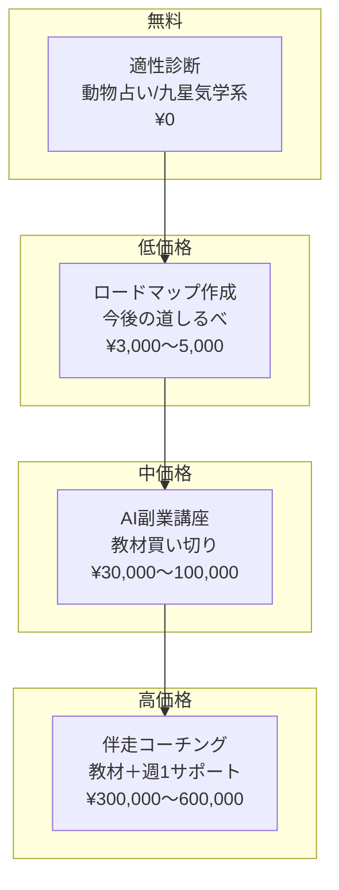
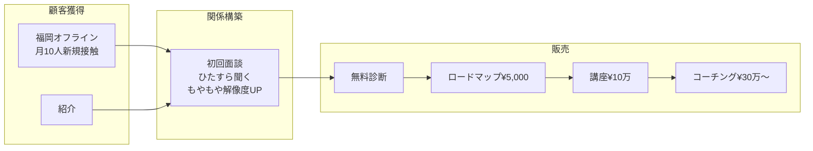

# 商品設計＆セールスファネル

---

## 📊 商品ラダー（価格階段）



---

## 💰 収益シミュレーション

### 月間目標（初期フェーズ）

| 商品 | 単価 | 月間販売数 | 月間売上 |
|------|------|-----------|---------|
| ロードマップ | ¥5,000 | 2〜3件 | ¥10,000〜15,000 |
| AI副業講座 | ¥100,000 | 1件 | ¥100,000 |
| 伴走コーチング | ¥300,000 | 0〜1件 | ¥0〜300,000 |
| **合計** | - | - | **¥110,000〜415,000** |

### 他の収入源
- 営業代行: 月40万円（安定収入）

---

## 🔄 セールスプロセス



---

## 🎯 初回面談の設計

### 目的
- 売り込まない
- 相手のもやもやの解像度を上げる
- 「この人と話してよかった」と思わせる

### ヒアリング項目
1. 今の仕事の満足度（10点満点で何点？）
2. 何がモヤモヤしてる？
3. 1年後、3年後どうなっていたい？
4. 過去に何か試したことは？
5. 今、優先度が高いのは何？（仕事/恋愛/お金/健康）

### クロージングトーク（恋愛→副業の論理）
```
「今、恋愛に月3〜10万使ってるんですね。
 でもうまくいってないのは、行動量じゃなくて"質"かもしれません。
 質って何かというと、自分に自信があるかどうか。
 自信は、自分の名前で成果を出すことで生まれます。
 会社の看板じゃなく、自分で稼げた経験があると、目の輝きが変わる。
 それが恋愛の質を上げる最短ルートかもしれません。
 
 今一番成果が出やすいのはAI副業です。
 まず、あなたに合ったロードマップを一緒に作りませんか？」
```

---

## 🤝 紹介設計

### 紹介者へのインセンティブ（案）
| 紹介で売れた商品 | 紹介者への報酬 |
|-----------------|---------------|
| ロードマップ ¥5,000 | ¥1,000〜2,000 |
| 講座 ¥100,000 | ¥10,000〜20,000 |
| コーチング ¥300,000 | ¥30,000〜50,000 |

### 紹介されやすい仕組み
1. 初回面談で価値提供 → 「あの人と話してよかった」
2. 紹介された人をティーアップ → 紹介者の株が上がる
3. 成約時にインセンティブ支払い → 紹介者にメリット

---

## 📦 サポート内容（高価格商品 ¥300,000/3ヶ月）

| サポート | 内容 |
|---------|------|
| 1on1ミーティング | 週1回（進捗確認＆軌道修正） |
| LINEサポート | 質問し放題＋毎日チェック |
| 電話 | 随時OK |
| 目標設計 | 3ヶ月→1ヶ月→週目標に分解 |

---

## 📚 講座コンテンツ（各¥100,000）

### 1. AIライティング副業講座（2日間）
- 対象: AI未経験・副業未経験者
- 内容:
  - AIライティングの基礎
  - ChatGPT/Claude活用法
  - 実際に記事を書く実践
- 成果物: ライティングスキル＋AIスキル

### 2. 案件獲得方法講座（2日間）
- 対象: スキルはあるが仕事が取れない人
- 内容:
  - クラウドソーシング攻略
  - 提案文の書き方
  - 単価交渉術
- 成果物: 案件獲得の武器

### 3. パーソナルミッション発見講座
- 対象: 自分の軸が見つからない人
- 内容:
  - 自己分析ワーク
  - 価値観の言語化
  - ミッションステートメント作成
- 成果物: 自分の軸

### 4. AI活用ポートフォリオ講座（買い切り）
- 対象: 自分のサイトを作りたい人
- 内容:
  - AIでできることの全体像
  - ポートフォリオサイト制作
  - 週1回のQ&A対応
- 成果物: 自分のポートフォリオサイト

---

## 📊 コンバージョン率の根拠

営業代行での実績ベース:
| ステップ | 率 | 根拠 |
|---------|-----|------|
| 接触 → 仲良くなる | 20〜30% | 月10人中2〜3人 |
| 仲良く → 初回面談 | 80〜90% | 無料カウンセリング実績 |
| 初回面談 → 何か購入 | 20〜30% | 123〜200万商品での実績 |

※ 価格帯が低い(¥5,000〜¥100,000)ので成約率は上がる見込み

---

## 🔧 次のタスク: 無料診断ツール作成

### AI副業適性診断
- 5〜10問の質問
- 「あなたに向いているAI副業はこれ」と診断結果
- Webツールとして実装

→ 別途壁打ちで解像度UP予定

---

*更新日: 2026-01-08*

