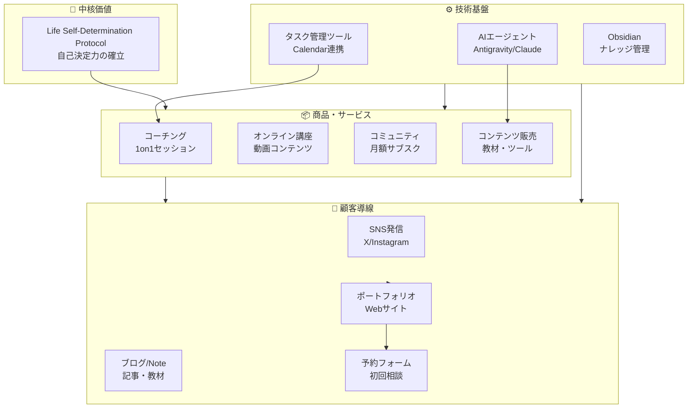
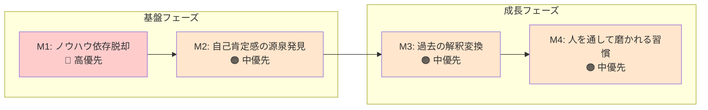
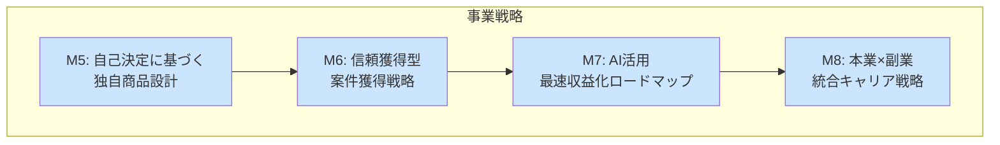
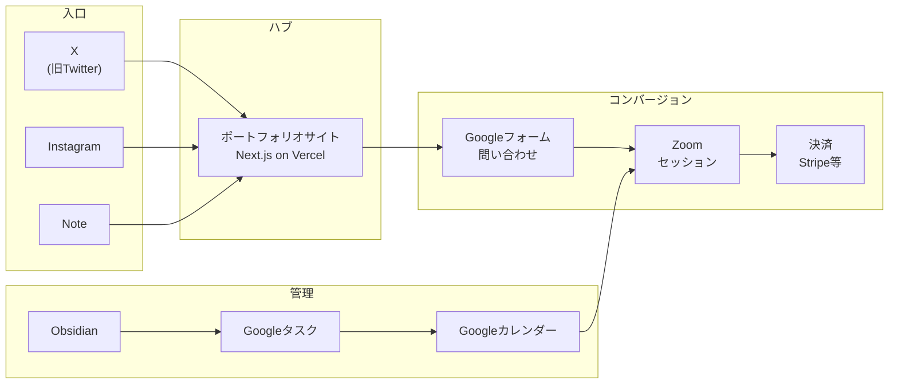
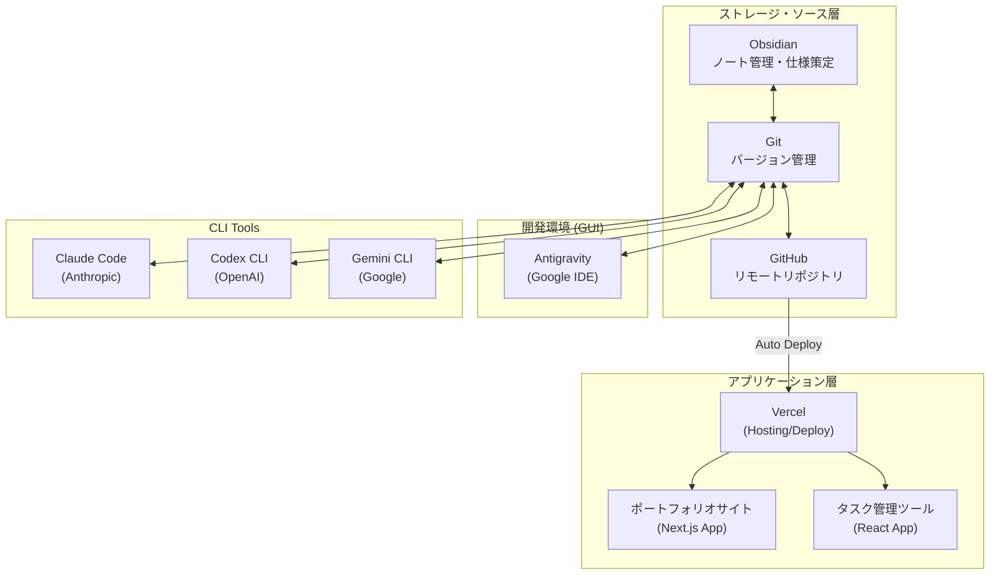
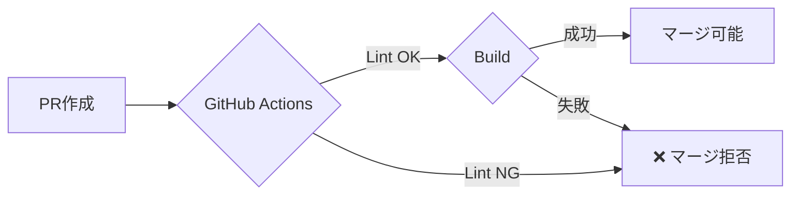
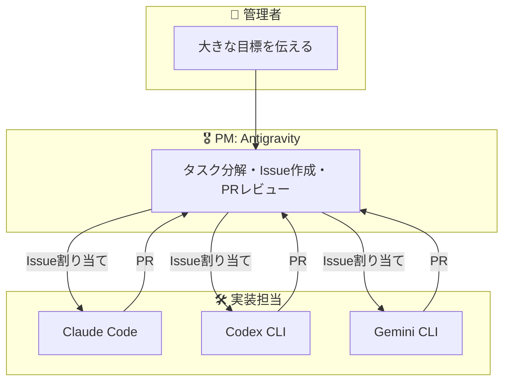

# 開発ツール連携図 & 事業構想

---

## 🎯 Life Self-Determination Protocol 事業構想

### ビジョン
**「自分の直感を再編し、魂の呼吸を守り抜く」**

自己決定の核を確立し、AIを「加速装置」として活用して人生を自分でデザインできる人を増やす。

---

## 📊 事業全体像 (Mermaid)

---

## 🧭 コーチングメソッド体系 (M1-M4)

---

## 💼 AIビジネス戦略 (M5-M8)

---

## 📈 収益モデル

| カテゴリ | 商品/サービス | 価格帯 | 頻度 |
|---------|--------------|--------|------|
| **コーチング** | 1on1セッション | 高 | 月1-4回 |
| **講座** | オンライン動画講座 | 中〜高 | 買い切り |
| **コミュニティ** | 月額メンバーシップ | 低 | 月額 |
| **コンテンツ** | 教材・ツール販売 | 低〜中 | 都度 |

---

## 🔗 プラットフォーム連携

---

## 📋 ポートフォリオサイト仕様

| 項目 | 内容 |
| :--- | :--- |
| **サイト名** | Life Self-Determination Protocol |
| **オーナー** | Takahiro Motoyama |
| **コンセプト** | 静寂の中で「自分の直感」を再編する / 魂の呼吸を守り抜く |
| **技術スタック** | Next.js, Framer Motion, Tailwind CSS, Lucide React |
| **デプロイ先** | Vercel |
| **主要構成** | Hero, Philosophy, Dashboard, Booking Form |
| **ターゲット** | 自己決定の核を確立し、AIを「加速装置」として活用したいビジネス層 |

---

## ⚙️ 開発ツール連携図

---

## 📊 ツール比較表

| ツール | 提供元 | タイプ | モデル | 本プロジェクトでの役割 |
|--------|--------|--------|--------|---------|
| **Obsidian** | Obsidian | GUI | - | 仕様検討・タスク管理・ナレッジ蓄積 |
| **Antigravity** | Google | GUI IDE | Gemini/Claude | 高度なコード生成・エージェント並列作業 |
| **Claude Code** | Anthropic | CLI | Claude | デバック、リファクタリング、論理的実装 |
| **Codex CLI** | OpenAI | CLI | GPT | ChatGPTコンテキストとの連携 |
| **Gemini CLI** | Google | CLI | Gemini | Google Cloud / Vertex AI 連携 |
| **Vercel** | Vercel | Platform | - | サイトホスティング |
| **タスク管理ツール** | 自作 | Web App | - | Google Calendar/Tasks連携 ✅完成 |

---

## 🎛 GitHubプロジェクト管理

### 管理体制
- **管理者**: 1人（あなた）
- **AIエージェント**: 複数（Antigravity, Claude Code, Codex CLI, Gemini CLI）

### GitHub Actions CI
PRが作成されるとLint/Buildが自動実行され、失敗するとマージがブロックされます。

### 主要ファイル
| ファイル | 用途 |
|---------|------|
| `.github/workflows/ci.yml` | Lint/Build自動チェック |
| `.github/CODEOWNERS` | 重要ファイルの保護 |
| `.github/ISSUE_TEMPLATE/ai_task.yml` | AI向けタスクテンプレート |
| `.github/pull_request_template.md` | PR記述テンプレート |

---

## 🤖 マルチエージェント階層構造

### ワークフロー
1. 管理者 → Antigravity に目標を伝える
2. Antigravity → タスク分解し GitHub Issue を作成
3. サブエージェント → Issue を確認し作業実行
4. サブエージェント → PR を作成
5. GitHub Actions → 自動チェック
6. Antigravity → レビュー・マージ・完了報告

> 📘 詳細: [[docs/multi_agent_guide|マルチエージェント運用ガイド]]

---

## 🚀 今後のロードマップ

### 短期（1-2週間）
- [x] M9: 並列開発ワークフロー確立 ✅
- [ ] ポートフォリオサイト完成

### 中期（1ヶ月）
- [ ] M1-M4: コーチングメソッド体系化
- [ ] オンライン講座の企画

### 長期（3ヶ月）
- [ ] M5-M8: AIビジネス戦略実行
- [ ] コミュニティ立ち上げ

---

*更新日: 2026-01-09*

