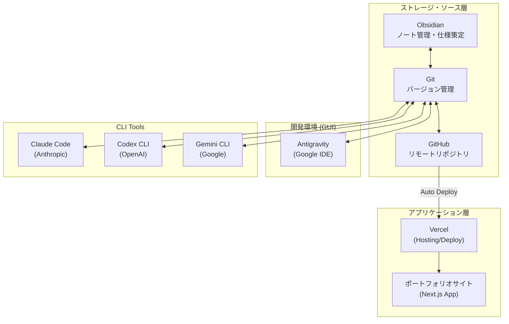

# 開発ツール連携図

## 概要

Obsidian、GitHub、各種AIツールの連携、および構築中のポートフォリオサイトの仕様と構成を示す。

---

## ポートフォリオサイト仕様

| 項目 | 内容 |
| :--- | :--- |
| **サイト名** | Life Self-Determination Protocol |
| **オーナー** | Takahiro Motoyama |
| **コンセプト** | 静寂の中で「自分の直感」を再編する / 魂の呼吸を守り抜く |
| **技術スタック** | Next.js, Framer Motion, Tailwind CSS, Lucide React |
| **デプロイ先** | Vercel |
| **主要構成** | Hero, Philosophy, Dashboard, Booking Form |
| **ターゲット** | 自己決定の核を確立し、AIを「加速装置」として活用したいビジネス層 |

---

## 開発ツール連携図 (Mermaid)

---

## ツール比較表

| ツール | 提供元 | タイプ | モデル | 本プロジェクトでの役割 |
|--------|--------|--------|--------|------|
| **Obsidian** | Obsidian | GUI | - | 仕様検討・タスク管理・ナレッジ蓄積 |
| **Antigravity** | Google | GUI IDE | Gemini/Claude | 高度なコード生成・エージェント並列作業 |
| **Claude Code** | Anthropic | CLI | Claude | デバック、リファクタリング、論理的実装 |
| **Codex CLI** | OpenAI | CLI | GPT | ChatGPTコンテキストとの連携 |
| **Gemini CLI** | Google | CLI | Gemini | Google Cloud / Vertex AI 連携 |
| **Vercel** | Vercel | Platform | - | ポートフォリオサイトのホスティング |

---

## 同期の流れ

1.  **Obsidian** で仕様・ドキュメントを編集 → Obsidian Git が自動コミット＆プッシュ
2.  **Antigravity / Claude Code** でコードを編集 → 手動または自動でコミット＆プッシュ
3.  すべての変更は **GitHub** に集約
4.  GitHub へのプッシュを検知して **Vercel** が自動ビルド＆デプロイを実行
5.  各開発環境で `git pull` すれば最新状態が同期される

---

*更新日: 2026-01-07*
